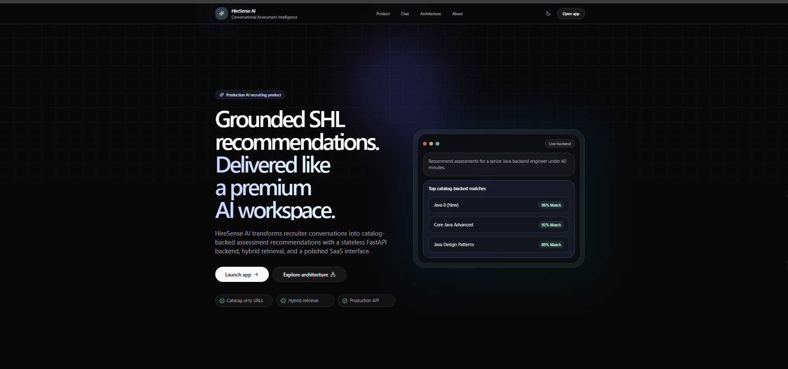
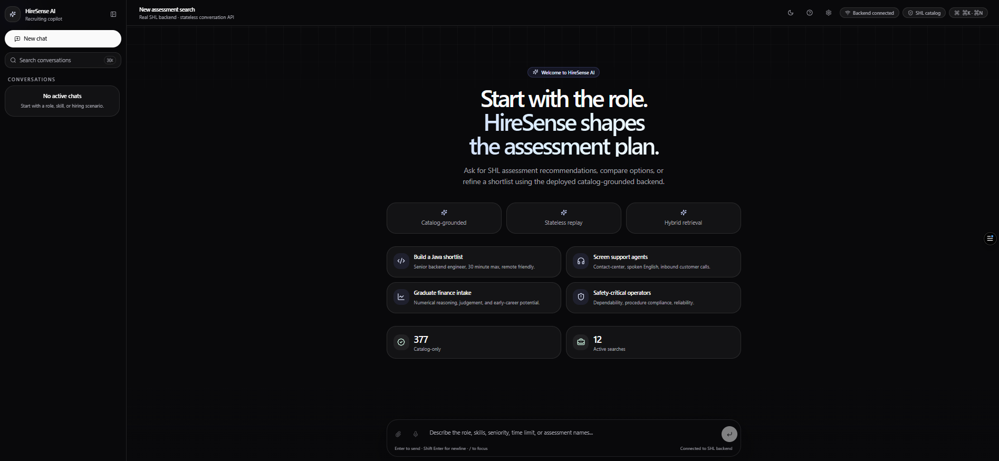
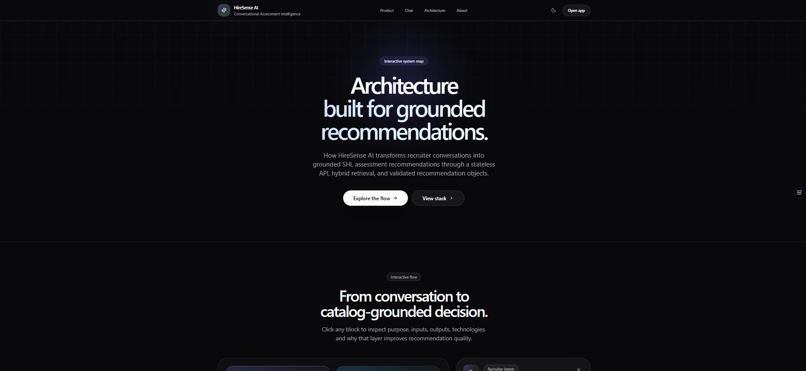
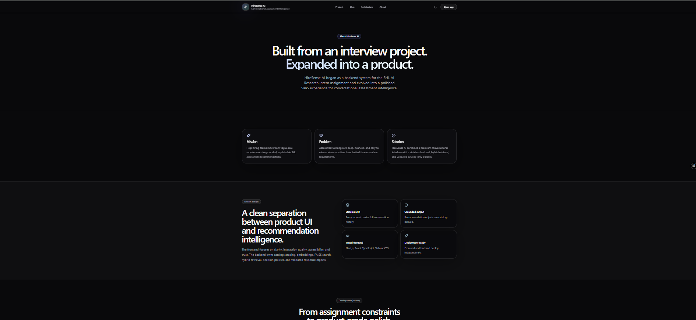
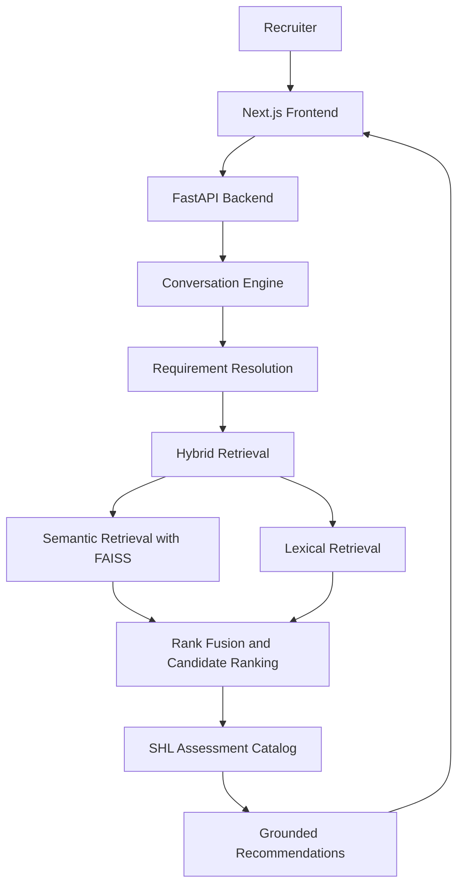

# HireSense AI

AI Recruiter Copilot for SHL Assessment Recommendations

HireSense AI is a production-style recruiter copilot that helps hiring teams discover relevant SHL assessment recommendations through a polished conversational interface. The product combines a modern Next.js frontend with a grounded FastAPI retrieval backend so recruiters can move from plain-language hiring needs to structured assessment shortlists.

[🌐 Live Demo](#) · [⚙ Backend Repository](#) · [🎥 Demo Video](#) · [📄 License](#license)

---

## Overview

Recruiters often need to navigate hundreds of assessment options while balancing role requirements, seniority, skills, duration, and candidate experience. Finding the right SHL assessments manually can be slow, inconsistent, and difficult to explain to stakeholders.

HireSense AI solves this with a conversational interface backed by hybrid retrieval. Recruiters describe what they are hiring for in natural language, and the system turns that request into grounded SHL assessment recommendations with official catalog links and recruiter-friendly reasoning.

Recommendations are grounded in an indexed catalog of SHL Individual Test Solutions. This project originated from an SHL AI engineering take-home challenge and later evolved into a production-style recruiter copilot experience.

This is an independent implementation and is not affiliated with or endorsed by SHL.

---

## Features

- **AI recruiter chat**  
  Conversational interface designed for recruiter workflows and hiring requirements.

- **Natural language hiring queries**  
  Supports prompts like “I need assessments for a senior Java backend engineer under 30 minutes.”

- **Hybrid Retrieval: Semantic + Lexical**  
  Combines vector search with keyword and metadata-aware retrieval for stronger recall.

- **377 indexed SHL assessments**  
  Uses a structured catalog artifact built from SHL Individual Test Solutions.

- **Grounded recommendations**  
  Recommendation objects come from trusted catalog metadata, not generated text.

- **Recommendation reasoning**  
  Explains why each assessment is relevant to the recruiter’s stated requirements.

- **Official SHL catalog links**  
  Every recommendation links back to the corresponding SHL catalog URL.

- **Conversation refinement**  
  Recruiters can update requirements, adjust constraints, and refine shortlists.

- **Responsive UI**  
  Designed for desktop, tablet, and mobile recruiting workflows.

- **Dark mode**  
  Premium dark interface with accessible contrast and polished interaction states.

- **FastAPI backend**  
  Stateless API with `/health` and `/chat` endpoints.

- **Next.js frontend**  
  App Router frontend built with React, TypeScript, TailwindCSS, and shadcn/ui.

- **Modern recruiter dashboard**  
  Sidebar conversations, prompt suggestions, recommendation cards, settings, and product pages.

- **Error handling**  
  Graceful handling for network failures, API errors, validation issues, and timeouts.

- **Production deployment**  
  Frontend targets Vercel. Backend targets Hugging Face Spaces using Docker.

---

## ?? Screenshots

### Landing Page

Introduce HireSense AI with a premium landing experience designed for recruiters and hiring teams.



---

### Conversational Search

Recruiters can describe hiring requirements in natural language and receive grounded assessment recommendations.



---

### Recommendation Summary

The AI explains why specific SHL assessments were selected before presenting the final shortlist.


---

### Recommendation Cards

Rich recommendation cards display assessment metadata, rationale, confidence indicators, and direct links to the official SHL catalog.


---

### Interactive Architecture

An interactive visualization explains the end-to-end recommendation pipeline, from recruiter intent to grounded assessment recommendations.



---

### About

Learn about the motivation, architecture, and design philosophy behind HireSense AI.



---

## Architecture



The frontend is responsible for product experience, conversation management, visual polish, API calls, and recommendation presentation. The backend owns requirement extraction, retrieval, ranking, validation, and grounded recommendation generation.

---

## Tech Stack

### Frontend

| Area | Technology |
| --- | --- |
| Framework | Next.js 15 |
| UI Runtime | React 19 |
| Language | TypeScript |
| Styling | TailwindCSS |
| Components | shadcn/ui |
| Motion | Framer Motion |
| Icons | Lucide React |
| Markdown | React Markdown |

### Backend

| Area | Technology |
| --- | --- |
| API | FastAPI |
| Language | Python 3.12 |
| Validation | Pydantic |
| Server | Uvicorn |
| Architecture | Stateless clean architecture |

### Retrieval

| Area | Technology |
| --- | --- |
| Embeddings | Sentence Transformers |
| Vector Search | FAISS |
| Lexical Search | Deterministic keyword retrieval |
| Ranking | Reciprocal Rank Fusion and candidate reranking |
| Catalog | Structured SHL assessment metadata |

### Deployment

| Area | Platform |
| --- | --- |
| Frontend | Vercel |
| Backend | Hugging Face Spaces |
| Backend Runtime | Docker |
| Artifact Storage | Git/Xet-compatible repository storage |

### Development Tools

| Area | Tooling |
| --- | --- |
| Package Management | npm |
| Linting | ESLint |
| Type Checking | TypeScript |
| Formatting | Prettier-compatible project conventions |
| Backend Quality | Ruff, MyPy, Pytest |

---

## Project Structure

```text
hiresense-ai/
├── app/                    # Next.js App Router routes and layouts
├── components/             # Reusable UI and product components
├── lib/                    # API client, utilities, configuration, and shared logic
├── hooks/                  # Reusable React hooks
├── public/                 # Static assets, favicon, and docs-ready placeholders
├── styles/                 # Global styles and theme tokens
└── README.md               # Product and developer documentation
```

Important frontend areas:

- **`app/`** defines public pages such as the landing page, chat, about, and architecture routes.
- **`components/`** contains reusable product UI including navigation, chat surfaces, dialogs, settings, and recommendation cards.
- **`lib/api/`** centralizes backend communication so React components never call `fetch` directly.
- **`lib/`** contains shared configuration, helpers, and product constants.
- **`public/`** stores static assets and screenshot placeholders for documentation.

---

## How It Works

1. **A recruiter enters a hiring request**  
   The user describes a role, skill set, seniority, duration constraint, or assessment need in natural language.

2. **The frontend sends the full conversation history**  
   The API is stateless, so each `/chat` request includes the complete message history.

3. **The backend reconstructs requirements**  
   The conversation engine extracts role, skills, seniority, test type, duration, and other constraints.

4. **Hybrid retrieval finds candidates**  
   Semantic FAISS search and deterministic lexical retrieval work together to find relevant SHL catalog entries.

5. **Candidates are ranked and validated**  
   The backend fuses retrieval signals, ranks candidates, and validates that every recommendation comes from the catalog.

6. **The frontend renders recruiter-ready cards**  
   HireSense AI displays recommendations with test type, rationale, official SHL links, and interactive actions.

---

## Local Development

### Prerequisites

- Node.js 18+
- npm
- A running HireSense AI backend

### 1. Clone the repository

```bash
git clone <frontend-repository-url>
cd hiresense-ai
```

### 2. Install dependencies

```bash
npm install
```

### 3. Configure environment variables

Create a local environment file:

```bash
cp .env.local.example .env.local
```

Set the backend API URL:

```env
NEXT_PUBLIC_API_BASE_URL=https://kanhaiyasharmaa-shl-assessment-recommender.hf.space
```

### 4. Run the development server

```bash
npm run dev
```

Open the app at:

```text
http://localhost:3000
```

### 5. Validate the project

```bash
npm run lint
npm run typecheck
npm run build
```

---

## Deployment

### Frontend: Vercel

The frontend is designed for Vercel deployment.

Recommended environment variable:

```env
NEXT_PUBLIC_API_BASE_URL=<deployed-backend-url>
```

Typical deployment flow:

1. Push the frontend repository to GitHub.
2. Import the repository into Vercel.
3. Configure `NEXT_PUBLIC_API_BASE_URL`.
4. Deploy.

### Backend: Hugging Face Spaces

The backend is designed to run separately on Hugging Face Spaces using Docker. It exposes:

- `GET /health`
- `POST /chat`

The frontend consumes only the public API and does not require direct access to backend internals.

---

## Future Roadmap

- Assessment comparison workflows
- Hiring plan generation
- Recruiter dashboard
- Saved hiring projects
- Analytics for recommendation sessions
- LLM-assisted recruiter guidance
- Candidate invitation workflow
- Practice assessment generator for preparation use cases, clearly separate from official SHL assessments

---

## Acknowledgements

This project was inspired by the SHL AI engineering take-home challenge and expanded into a production-style recruiter copilot.

Thank you to SHL for inspiring the original problem statement.

This project is an independent implementation and is not affiliated with or endorsed by SHL.

---

## License

MIT License placeholder. Add the final license file before public release.
